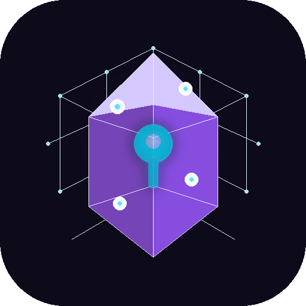

# KyberVault — Post-Quantum Encryption for Android

<p align="center">
  
</p>

<p align="center">
  <strong>Quantum-resistant key vault & encrypted messaging toolkit</strong><br>
  Kyber-1024 · X25519 · AES-256-GCM · Zero Cloud
</p>

<p align="center">
  <a href="https://play.google.com/store/apps/details?id=com.kybervault">
    
  </a>
  
  
</p>

---

## What Is KyberVault?

KyberVault is an offline-only Android app that generates, stores, and manages post-quantum encryption keys entirely on your device. It performs hybrid Kyber-1024 + X25519 key encapsulation, AES-256-GCM symmetric encryption, and secure key exchange — all without a single network call.

No accounts. No cloud. No telemetry. Your keys never leave your phone.

---

## Why Post-Quantum?

Today's public-key encryption (RSA, ECDH) will be broken by sufficiently powerful quantum computers. KyberVault uses **Kyber-1024** (NIST ML-KEM, standardized 2024) combined with classical **X25519** in a hybrid mode. If either algorithm holds, your data stays safe — protecting against both current and future threats.

---

## Features

### Key Generation
- **Kyber-1024** (ML-KEM) post-quantum key pairs
- **X25519** elliptic curve key pairs
- **Hybrid mode** combining both for defense-in-depth
- **AES-256-GCM** session key generation

### Key Storage
- RAM-only by default — keys destroyed on app exit
- Optional encrypted persistence via Android Keystore (AES-256-GCM, hardware-backed)
- Named key aliases with save, load, and wipe controls

### Key Exchange
- Full KEM (Key Encapsulation Mechanism) workflow
- Import recipient public keys via paste or QR scan
- Generate and exchange encrypted session keys
- Wire format for compact ciphertext sharing

### Encrypted Messaging
- AES-256-GCM authenticated encryption with session keys
- Encrypt/decrypt messages in the messaging tab
- Copy, share, or QR-code any output

### Security
- **Three independent auth methods**: Biometric fingerprint, TOTP 2FA, PIN lock
- **FLAG_SECURE** screenshot and screen recording protection
- **Root/debugger/emulator detection** with threat banners
- **Cloud backup disabled** in manifest
- **No INTERNET permission** — zero network capability
- **Log stripping** in release builds (Log, System.out, printStackTrace)
- **ProGuard obfuscation** with aggressive repackaging

### Accessibility & Localization
- 13 languages: English, Spanish, French, German, Italian, Portuguese, Japanese, Korean, Chinese (Simplified), Arabic, Hindi, Russian, Ukrainian
- OpenDyslexic font toggle
- Material 3 dark theme with dynamic color

---

## Security Architecture

```
┌──────────────────────────────────────────────────────────────┐
│                        KyberVault                            │
│                                                              │
│  ┌────────────┐  ┌─────────────┐   ┌────────────────────┐    │
│  │  KeyGen    │  │  Exchange   │   │     Messaging      │    │
│  │ Kyber-1024 │  │ KEM Encap/  │   │  AES-256-GCM       │    │
│  │   X25519   │  │  Decap      │   │  Session Encrypt   │    │
│  │   Hybrid   │  │ + Wire Fmt  │   │  / Decrypt         │    │
│  └─────┬──────┘  └──────┬──────┘   └─────────┬──────────┘    │
│        │                │                    │               │
│        ▼                ▼                    ▼               │
│  ┌───────────────────────────────────────────────────────┐   │
│  │            EphemeralKeyVault (RAM ONLY)               │   │
│  │  • ConcurrentHashMap<alias, KeyBundle>                │   │
│  │  • 3-pass secure wipe with volatile sink              │   │
│  │  • Session key management per alias                   │   │
│  └────────────────────────┬──────────────────────────────┘   │
│                           │ (optional, user-acknowledged)    │
│  ┌────────────────────────▼──────────────────────────────┐   │
│  │       Encrypted File Persistence (opt-in only)        │   │
│  │  • AES-256-GCM via Android Keystore                   │   │
│  │  • Hardware-backed master key (StrongBox/Titan M2)    │   │
│  │  • Security warning + explicit acknowledgment         │   │
│  └───────────────────────────────────────────────────────┘   │
│                                                              │
│  ┌───────────────────────────────────────────────────────┐   │
│  │                 Auth Gate (layered)                   │   │
│  │  Biometric → TOTP 2FA → PIN → Access granted          │   │
│  └───────────────────────────────────────────────────────┘   │
│                                                              │
│  HARDENING:                                                  │
│  ✗ No INTERNET permission       ✗ No backup / no transfer   │
│  ✗ No screenshots (FLAG_SECURE) ✗ No analytics / telemetry  │
│  ✗ Root / debugger detection    ✗ Log calls stripped        │
└──────────────────────────────────────────────────────────────┘
```

## Crypto Primitives

| Component | Algorithm | Security Level | Library |
|-----------|-----------|---------------|---------|
| KEM | Kyber-1024 (ML-KEM-1024) | NIST Level 5 | Bouncy Castle 1.83 |
| ECDH | X25519 | 128-bit | Android JCA |
| Hybrid KEM | Kyber-1024 + X25519 + HKDF | Combined | BC + JCA |
| Symmetric | AES-256-GCM | 256-bit | JCE (Android) |
| IV | 12-byte random | NIST SP 800-38D | SecureRandom |
| Auth Tag | 128-bit GCM | Full tag length | JCE |
| TOTP | HMAC-SHA1, 6-digit, 30s | RFC 6238 | Custom implementation |
| Key Storage | Android Keystore | Hardware-backed | StrongBox / Titan M2 |
| QR Encoding | ZXing | — | ZXing 3.5.4 |

## Encryption Modes

### Hybrid Mode (Kyber + X25519)
1. Kyber-1024 `Encapsulate(recipient_kyber_pub)` → `(kyber_ct, kyber_secret)`
2. X25519 `ECDH(ephemeral_priv, recipient_x25519_pub)` → `x25519_secret`
3. `HKDF(kyber_secret || x25519_secret)` → `combined_key_32B`
4. AES-256-GCM `Encrypt(plaintext, combined_key, aad="KYBER1024-X25519-HYBRID-AES256GCM")`
5. Output: `KV1:2:H:{kyber_ct}:{x25519_eph_pub}:{aes_ct}` (wire format v2)

### Kyber-Only Mode
1. Kyber-1024 `Encapsulate(recipient_pub)` → `(kem_ct, shared_secret)`
2. AES-256-GCM `Encrypt(plaintext, shared_secret, aad="KYBER1024-AES256GCM")`
3. Output: `KV1:2:K:{kem_ct}:{aes_ct}` (wire format v2)

### AES Session Mode
- Direct AES-256-GCM with a pre-shared session key
- For ongoing messaging after initial key exchange

---

## Project Structure

```
app/src/main/java/com/kybervault/
├── KyberVaultApp.kt                 # Application lifecycle
├── MainActivity.kt                  # Navigation + auth gate + FLAG_SECURE
├── crypto/
│   ├── KyberEngine.kt              # Kyber-1024 generate/encap/decap
│   ├── X25519Engine.kt             # X25519 key agreement
│   ├── HybridKem.kt                # Combined Kyber+X25519+HKDF
│   ├── AesEngine.kt                # AES-256-GCM encrypt/decrypt
│   ├── TotpEngine.kt               # RFC 6238 TOTP generation
│   └── CryptoFacade.kt             # Unified crypto pipeline
├── data/
│   ├── EphemeralKeyVault.kt         # RAM key store + encrypted persistence
│   └── EncryptedPayload.kt         # Wire format serialization
├── i18n/
│   └── Strings.kt                  # 13-language string table
├── security/
│   ├── SecurityHardening.kt         # Root/debug/emulator detection
│   └── BiometricHelper.kt          # Biometric auth wrapper
├── ui/
│   ├── VaultViewModel.kt           # State management
│   ├── VaultUiState.kt             # UI state data class
│   ├── theme/Theme.kt              # Material 3 dark theme
│   ├── screens/
│   │   ├── KeyGenScreen.kt         # Key generation + save/load/wipe
│   │   ├── ExchangeScreen.kt       # KEM exchange workflow
│   │   └── MessageScreen.kt        # AES session messaging
│   └── components/
│       ├── SettingsDialog.kt        # All app settings
│       ├── InfoDialog.kt           # About / documentation
│       ├── WipeDialog.kt           # RAM vs storage wipe
│       ├── PinDialog.kt            # PIN setup/verify
│       ├── TotpDialogs.kt          # TOTP setup/verify
│       ├── CopyShareBar.kt         # Copy/QR/share actions
│       ├── QrDialog.kt             # QR code display
│       ├── ClipboardWarning.kt     # Clipboard security notice
│       ├── SaveWarningDialog.kt    # Storage persistence warning
│       ├── SecurityBanner.kt       # Threat detection banner
│       └── KeyStatusBar.kt         # Active key indicator
└── util/
    └── SecureWipe.kt               # 3-pass memory wipe
```

---

## Building

### Prerequisites
- **Android Studio** Meerkat (2025.1+) or newer
- **JDK 17+** (bundled with Android Studio)
- **Android SDK 36**
- **Gradle 9.3.1** (wrapper included)

### Build & Run
```bash
# Clone
git clone https://github.com/Darkstar2-4/KyberVault.git
cd KyberVault

# Open in Android Studio → Sync Gradle → Run (Shift+F10)

# Or from command line:
./gradlew assembleDebug
adb install app/build/outputs/apk/debug/app-debug.apk
```

### Signed Release AAB (for Play Store)
```bash
# Via Android Studio:
# Build → Generate Signed Bundle / APK → Android App Bundle → sign → Finish
# Output: app/build/outputs/bundle/release/app-release.aab
```

---

## Security Model

| Mode | Storage | Survives Reboot | Attack Surface |
|------|---------|----------------|----------------|
| **RAM-only** (default) | Heap memory | ❌ No | Lowest |
| **Encrypted file** (opt-in) | AES-256-GCM via Keystore | ✅ Yes | Higher |

### Known Limitations
- **JVM GC**: Java's garbage collector may copy byte arrays before wipe. True defense requires JNI `mlock()`.
- **Side channels**: No power analysis or EM countermeasures.
- **Key exchange**: Public key distribution requires a separate secure channel.

---

## Beta Testing

KyberVault is currently in closed beta on Google Play. If you'd like to help test:

1. [Join the beta](https://play.google.com/apps/testing/com.kybervault)
2. Install from the Play Store link provided after joining
3. Report issues via [GitHub Issues](https://github.com/Darkstar2-4/KyberVault/issues)

Beta testers get the app for free.

---

## Privacy

KyberVault collects **zero data**. No accounts, no analytics, no network calls. Everything stays on your device. [Full privacy policy](https://darkstar2-4.github.io/KyberVault/privacy-policy.html).

---

## Support Development

KyberVault is free and open source. If you find it useful:

**BTC**: `bc1q28sq3z2z9mzyesey0023e9240tv48cyv8vw2v2`

---

## License

Open source. Cryptographic software may be subject to export controls in your jurisdiction.
